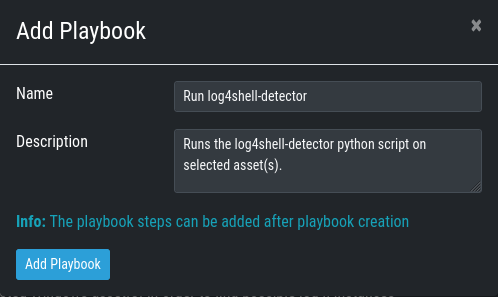
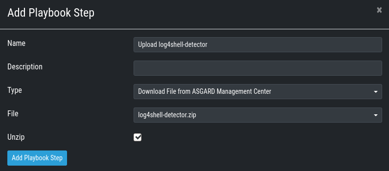
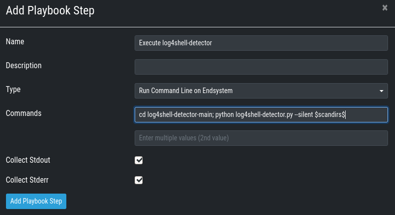

# Playbooks and Scripts for ASGARD to execute log4shell-detector
This playbook enables the usage of the [log4shell-detector](https://github.com/Neo23x0/log4shell-detector) script with ASGARD Management Center.

## Playbook Creation
For the playbooks to work some files need to be put into the `/var/lib/nextron/asgard2/playbook-files` directory of ASGARD:

1. The package of Florian Roth's log4shell-detector repository in ZIP format. Download [here](https://github.com/Neo23x0/log4shell-detector) and rename to `log4shell-detector.zip`.

You can use the file upload feature during playbook creation to achieve that:

If you need to edit or update the file, you can do that using scp, rsync, WinSCP or whatever tool you use for Linux file transfer. Do not forget to change the file ownership to **asgard2:asgard2**
(e.g. `chown asgard2: /var/lib/nextron/asgard2/playbook-files/log4shell-detector.zip`), if it was changed by uploading.

### How to Create a Playbook
*This section explains how to create a playbook in detail. If you are familiar with ASGARD's playbook creation, see the overview of the next section.*

Go to **Response Control > Playbooks > Add Playbook**, enter
* Name: Run log4shell-detector
* Description: Runs the log4shell-detector python script on selected asset(s).

and click **Add Playbook**.

Next add the single playbook steps. Therefore click anywhere on the newly created playbook to open its drop-down menu and then choose **Add Step** for each of the following Steps:

1. Upload log4shell-detector

- Choose the already uploaded 'log4shell-detector.zip' or select **Upload New File** if you want to upload it from the browser.
- Check 'Unzip' box

2. Execute log4shell-detector

- Commands: `cd log4shell-detector-main; python log4shell-detector.py --silent -p $path$`
    

### Log4shell Detector Playbook

Text for Copy-Paste:
* Name: Run log4shell-detector
* Description: Runs the log4shell-detector python script on selected asset(s).
* Step 1:
	* Name: Upload log4shell-detector
    * Type: Download File from ASGARD MC
    * Unzip: Checked
* Step 2:
	* Name: Execute log4shell-detector
    * Type: Run Command Line on Endsystem
    * Command: `cd log4shell-detector-main; python log4shell-detector.py --silent -p $path$`
