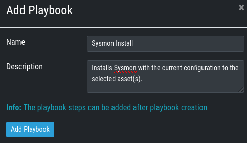
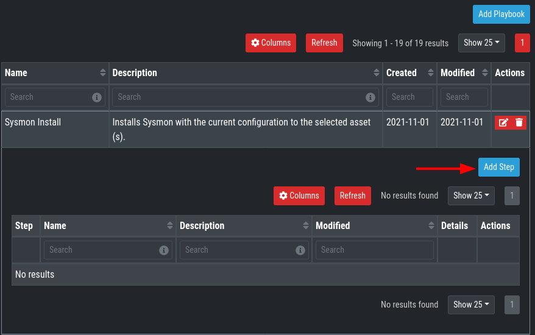
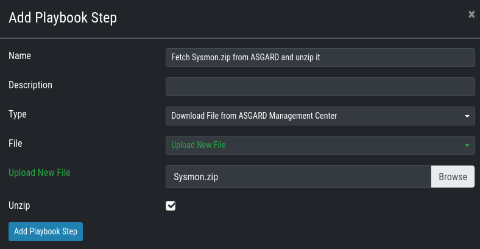
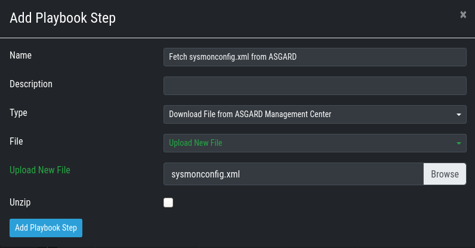
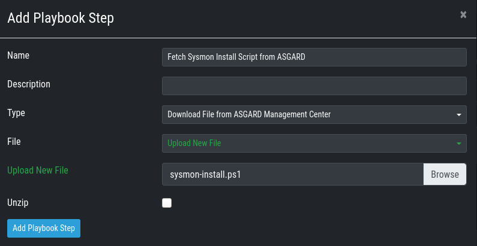
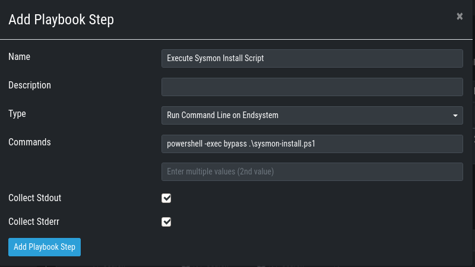
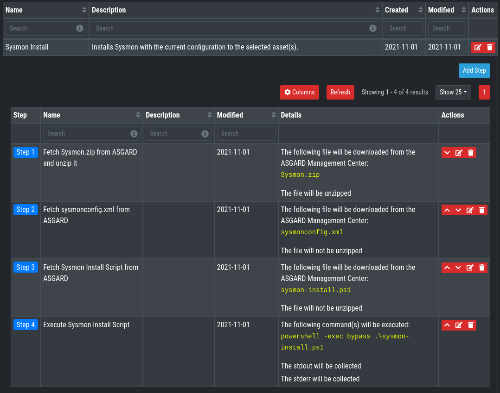
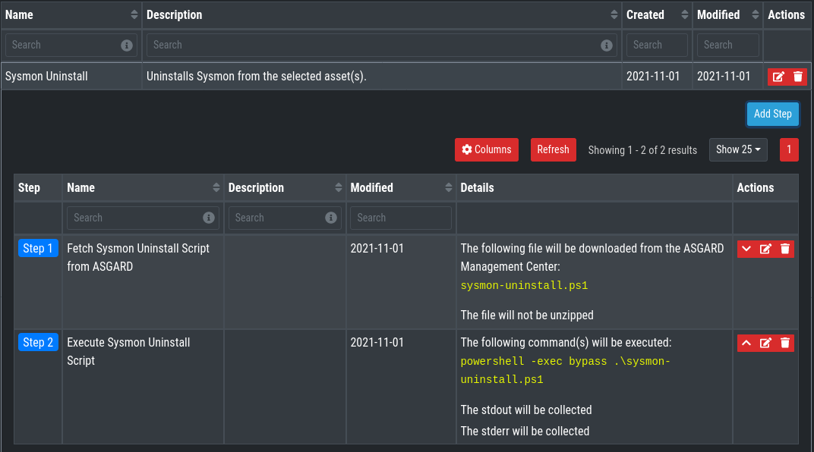
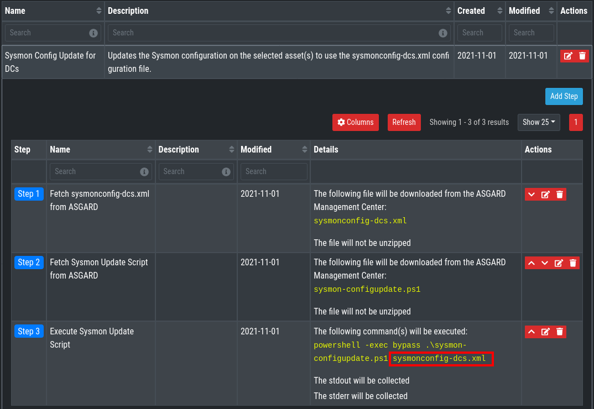

# Sysmon Maintenance Playbooks and Scripts for ASGARD

## Playbook Creation
For the playbooks to work, some files need to be put into the `/var/lib/nextron/asgard2/playbook-files` directory of ASGARD:

1. A current version of [Sysmon.zip](https://download.sysinternals.com/files/Sysmon.zip)
2. Your Sysmon config called `sysmonconfig.xml`
3. The playbook Powershell scripts from this repo's [playbook-files](playbook-files)

You can use the file upload feature during playbook creation to achieve that:

If you need to edit or update the files, you can do that using scp, rsync, WinSCP or whatever tool you use for Linux file transfer.
Do not forget to change the file ownership to  **asgard2:asgard2**
(e.g. `chown asgard2: /var/lib/nextron/asgard2/playbook-files/[Ss]ysmon*`), if it was changed by uploading.

### Choosing a Sysmon configuration
If you do not have a Sysmon configuration yet, there are several options we suggest:

1. The Nextron Systems fork of SwiftOnSecurity's [sysmon-config](https://github.com/Neo23x0/sysmon-config)
2. The SwiftOnSecurity [sysmon-config](https://github.com/SwiftOnSecurity/sysmon-config)
3. Olaf Hartong's [sysmon-modular](https://github.com/olafhartong/sysmon-modular)

In general we suggest our own config, as we test our rules with it and include changes from the upstream configuration. But depending on your preferences, either of those listed configurations are good starting points for writing your own config.

NOTE: Test your configuration and configuration changes before rolling them out to a greater number of systems. Every environment is unique.

### How to Create a Playbook
*This section explains how to create a playbook for the Sysmon installation in detail. If you are familiar with ASGARD's playbook creation, see the overview of the Sysmon playbooks in the next 3 sections.*

Go to **Response Control > Playbooks > Add Playbook**, enter
* Name: Sysmon Install
* Description: Installs Sysmon with the current configuration to the selected asset(s).

and click **Add Playbook**.

Next add the single playbook steps. Therefore click anywhere on the newly created playbook to open its drop-down menu and then choose **Add Step** for each of the following Steps:

1. Fetch Sysmon.zip from ASGARD and unzip it

	- Check the Unzip box
2. Fetch sysmonconfig.xml from ASGARD

	- The name  `sysmonconfig.xml` is used in the installer script
3. Fetch Sysmon Install Script from ASGARD

4. Execute Sysmon Install Script

	- Commands: `powershell -exec bypass .\sysmon-install.ps1`

### Overview - Sysmon Install Playbook

Text transcription of the screenshot:
* Name: Sysmon Install
* Description: Installs Sysmon with the current configuration to the selected asset(s).
* Step 1:
	* Name: Fetch Sysmon.zip from ASGARD and unzip it
* Step 2:
	* Name: Fetch sysmonconfig.xml from ASGARD
* Step 3:
	* Name: Fetch Sysmon Install Script from ASGARD
* Step 4:
	* Name: Execute Sysmon Install Script
	* Commands: `powershell -exec bypass .\sysmon-install.ps1`

### Overview - Sysmon Config Update Playbook

Text transcription of the screenshot:
* Name: Sysmon Configuration Update
* Description: Updates the Sysmon configuration on the selected asset(s).
* Step 1:
	* Name: Fetch sysmonconfig.xml from ASGARD
* Step 2:
	* Name: Fetch Sysmon Update Script from ASGARD
* Step 3:
	* Name: Execute Sysmon Update Script
	* Commands: `powershell -exec bypass .\sysmon-configupdate.ps1`

### Overview - Sysmon Uninstall Playbook

Text transcription of the screenshot:
* Name: Sysmon Uninstall
* Description: Uninstalls Sysmon from the selected asset(s).
* Step 1:
	* Name: Fetch Sysmon Uninstall Script from ASGARD
* Step 2:
	* Name: Execute Sysmon Uninstall Script
	* Commands: `powershell -exec bypass .\sysmon-uninstall.ps1`

### Using multiple Sysmon configurations
If you use more than one sysmon config, you can upload your configurations to ASGARD under different names and using an additional Sysmon Config Update Playbook. You can give an additional parameter to the Sysmon update or install  script to use a different configuration. An example for updating the Sysmon config for domain controllers is given below:

Text transcription of the screenshot:
* Name: Sysmon Config Update for DCs
* Description: Updates the Sysmon configuration on the selected asset(s) to use the sysmonconfig-dcs.xml configuration file.
* Step 1:
	* Name: Fetch sysmonconfig-dcs.xml from ASGARD
* Step 2:
	* Name: Fetch Sysmon Update Script from ASGARD
* Step 3:
	* Name: Execute Sysmon Update Script
	* Commands: `powershell -exec bypass .\sysmon-configupdate.ps1 sysmonconfig-dcs.xml`

